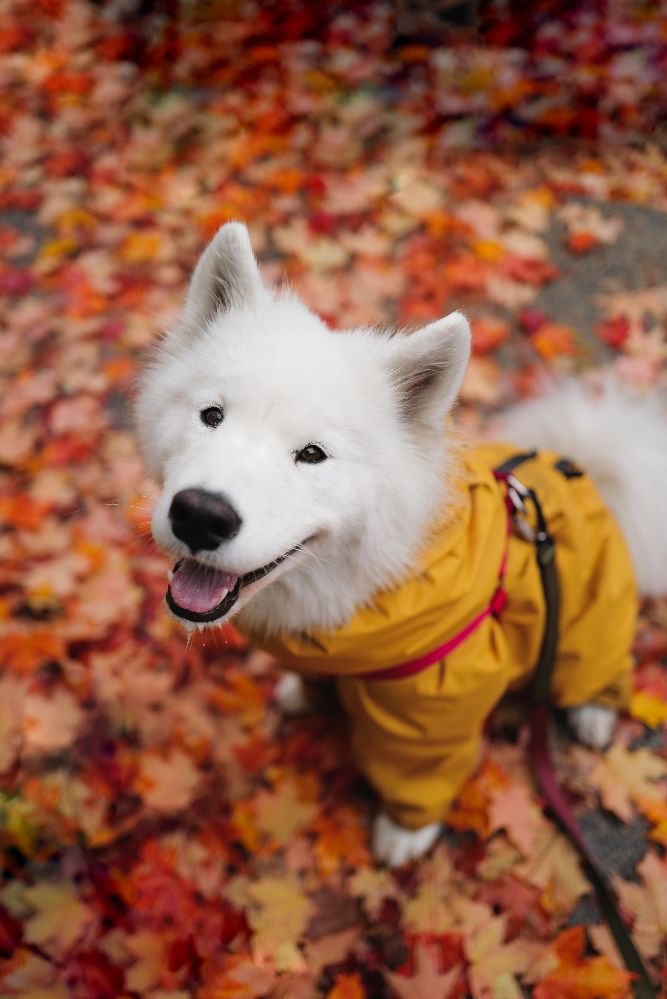
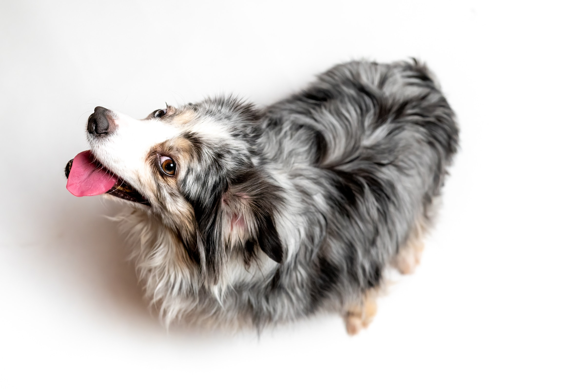
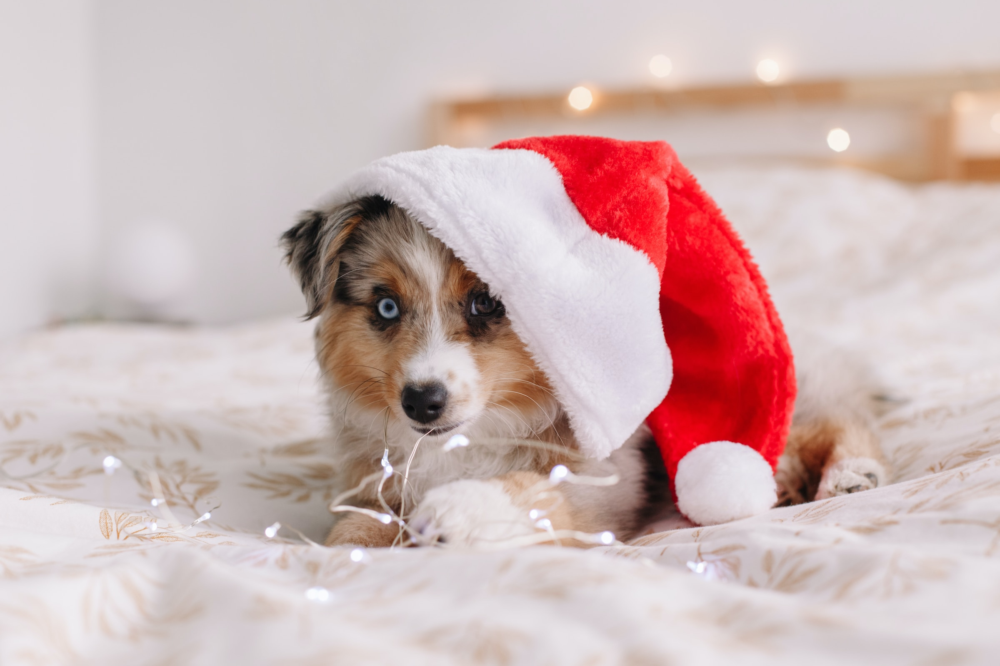

This component for [GoHugo](https://gohugo.io/) adds partials and shortcodes to resolve and process images on your website. It offers responsive image formats and optimised loading based on current browser abilities.


Check back for better documentation and more features. The following documentation is, as long as this note is here, only partial and might be missing important points. If you have any questions, or ideas, please [add an issue to the issue tracker](https://github.com/davidsneighbour/hugo-blockify/issues).


## Notes

- Image processing (aka. resizing, filters, cropping etc) is only available in Global and Page Resources. Global Resources are located in the `assets` folder of your repository, Page Resources are located within the `content` directory with your content files in so called Page Bundles. The images in your `static` directory are loaded as they are, not processed (other than evaluation of content type and sizing) and will not result in responsive image tags. All other features or options will work.
- Lookup of images:
  - page bundle
  - global resources
  - static folder
  - warning about image not found on CLI
- using `name` implies page resource and no further lookup will be done after image is not found

## Shortcodes

Available shortcodes currently are `figure` and `gallery`. Those shortcodes are served by partials that you can use in your own layout files with more extensive configurability. `figure` overrides the GoHugo internal `figure` shortcode.

### Figure Shortcode

Possible call scenarios:

With unnamed parameters (static images preferred):

```go-html-template


```

With named parameters:

```go-html-template

caption
caption
```

For now we think about device pixel ratios up to 4. (<-- NOTE: what did we mean by that? Probably a 4xdpi thingy?)

#### Parameters

| option | type | notes |
| --- | --- | --- |
| `name` | string | resource name to show (resources are defined in frontmatter or it's the filename of the image in a page bundle |
| `src` | string | image to show (optional). must be relative to the static folder |
| `link` | string | link the image to something |
| `linktarget` | string | target of the link (typically you would want `_blank` as value for a new window, but anything goes here) |
| `class` | string | additional classes for the image (Note: not sure if image or figure tag) |
| `alt` | string | alt attribute for the image (optional, suggested) |
| `title` | string | title attribute for the image (optional) |
| `command` | string | command for image processing (optional, required with `options`) |
| `options` | string | options for image processing (optional, required with `command`) |
| `width` | number | width of the image (optional, could be evaluated from the resulting image) |
| `height` | number | height of the image (optional, could be evaluated from the resulting image) |

Tagvariants:

```go-html-template
Something

```

### Gallery Shortcode

to be written.

Notes: right now it expects a galleryid parameter for a folder inside of pagebundle/gallery/galleryid and a type for bootstrap4 or bootstrap5. All images in that directory are parsed and shown. No sorting (todo), no gallery selection by frontmatter (todo).

## Partials

### Figure Partial

The figure partial executes the end of the shortcode (wording?) and can be called with an options dictionary of the following format:

```json { single=true }
{
 "name": "",
 "src": "",
 "height": 100,
 "width": 100,
 "title": "",
 "alt": "",
 "class": "",
 "link": "link to put the image in, param `link` required on the shortcode",
 "caption": "markdownified content of .Inner, used for the caption of the image",
 "srcset": "",
}
```

### Gallery Partial

## Configuration

### global Configuration

To be written.

### configuration per shortcode/partial

Should be explained in their own chapters above.

## Optimisation

To be written.

Notes about:

- resources directory
- caching (with hugo-netlification)
- preloading (needs implementation)
- maybe a walkthrough how this module implements current features?

## Further Readings

- [A list of up to date best practices for web images by nucliweb](https://github.com/nucliweb/image-element) (those practices are all implemented in this module)

## Usage Examples

### Markdown Render Hook

```markdown

```


```markdown

```


```markdown

```



## Sample Photo Sources

- [Dog 1](https://unsplash.com/photos/PjgeDNHhg_8), [Dog 2](https://unsplash.com/photos/itru42lAV6E), [Dog 3](https://unsplash.com/photos/ah63B7-mo3w) --- License: [Unsplash+ License](https://unsplash.com/plus/license)
