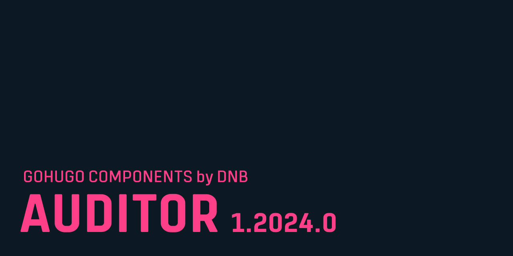

# GoHugo Component / Auditor

This module is a component for [GoHugo](https://gohugo.io) that adds auditing tools to your development website. It is not thought for use in a live deployment. It is work in progress.

Read more about it [in the documentation](documentation/index.md). 

> [!WARNING]
> The documentation is provided as is and was at the point of writing work in progress. Things might have changed.
