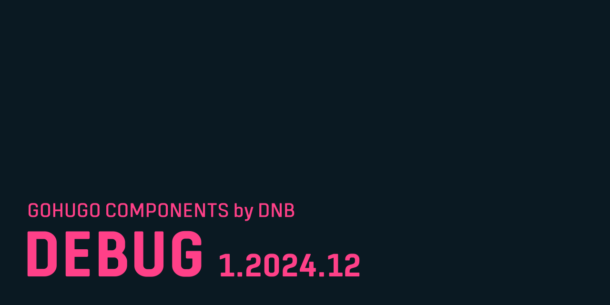
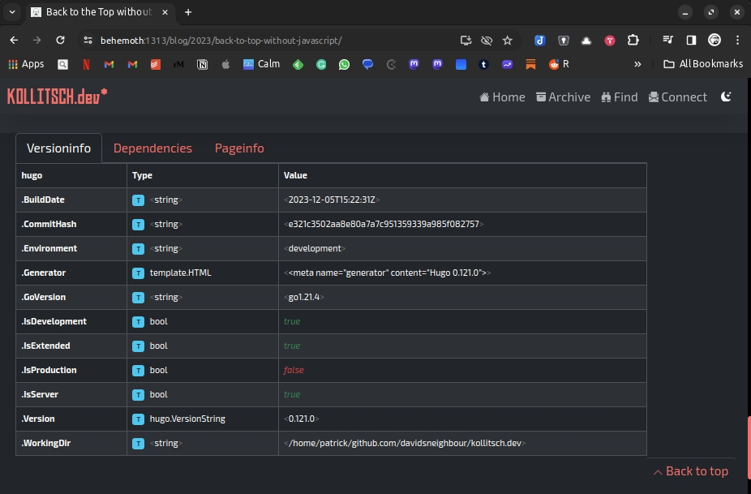

# GoHugo Modules / Debug

This module for GoHugo adds debugging partials for many use cases.

Read more about it [in the documentation](https://kollitsch.dev/gohugo/debug).



## Install version based

The latest releases of this module will always be based on and work with the latest release of GoHugo. To install the latest release of this module, run:

```bash
hugo mod get -u github.com/davidsneighbour/hugo-modules/modules/debug
```

To install version for older Hugo versions, run the command with the following version tags:

| Hugo Version | Debug Version | Installation Path |
| --- | --- | --- |
| 0.120.0 | v1.2023.19 | `hugo mod get -u github.com/davidsneighbour/hugo-modules/modules/debug@v1.2023.19` |

## Breaking Changes

* **v1.2023.26:**
  * The partial `debugprint.html` has been renamed to `debug-print.html`. Please update your templates.
  * The partial `debug.html` has been renamed to `debug-cli.html`. Please update your templates.
  * Both deprecated partials will be removed after 2024-03-14.
  * The functionality of the partials remains the same after renaming.
