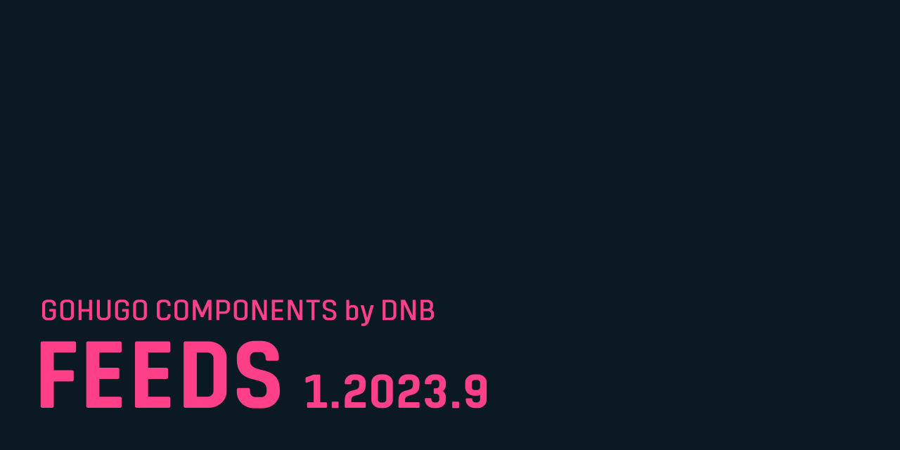

# GoHugo Module / Feeds

This is a GoHugo theme component that implements various configurable feed formats. Currently implemented formats are RSS, Atom and JSON feed.

Find out more about the [RSS](https://cyber.harvard.edu/rss/rss.html), [Atom](https://datatracker.ietf.org/doc/html/rfc4287) and [JSON feed](https://www.jsonfeed.org/version/1.1/) formats

Read the full documentation on [kollitsch.dev/components/hugo-feeds](https://kollitsch.dev/components/hugo-feeds).
