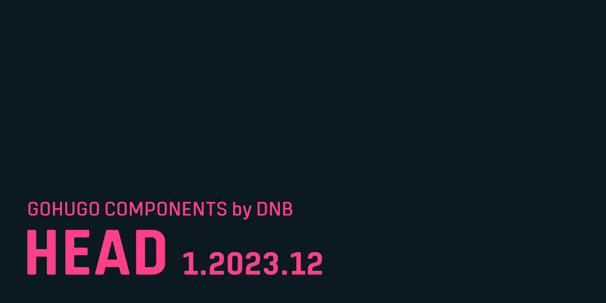

# GoHugo Component / Head

This [GoHugo](https://gohugo.io) theme component solves the old question, "What tags belong into the `<head>` tag of my website?" Set it up, configure it, and forget it's there. This component adds a multitude of tags and is extensively configurable.

If you want to independently of this module learn about all that is possible in the `<head>` tag, then have a look at [htmlhead.dev](https://htmlhead.dev/)

Read more about it [in the documentation](https://kollitsch.dev/components/hugo-head/).
