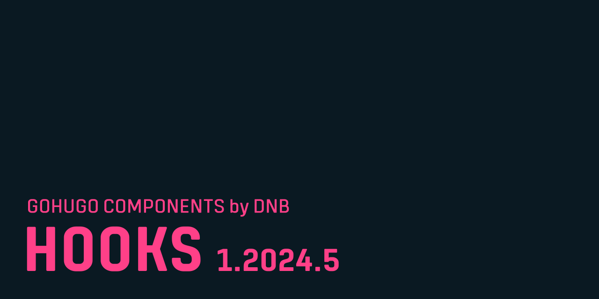

# DNB GoHugo Component / Hooks

The GoHugo Hooks module is a straightforward and efficient solution for adding custom content and processing/filtering to your GoHugo themes. It allows users and developers to insert various elements, such as scripts or design features, into specific areas of their website templates. This module enhances theme flexibility and performance, offering caching options and easy integration with other plugins, making it a practical choice for customizing and improving GoHugo-based websites.

Read more about it [in the documentation](https://dnbhub.xyz/hooks/).
