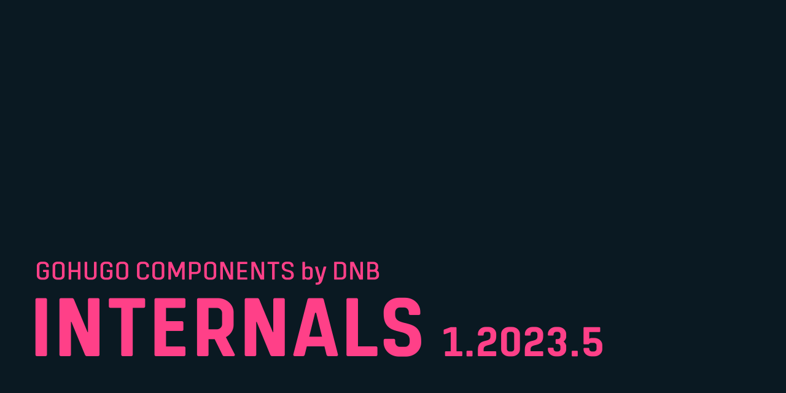

This module attempts to replace internal templates used by Hugo with custom ones and other modules and plugins that add identical features more sophisticated or up-to-date. The internal templates of Hugo are highly opinionated, often out of time and not suitable for use in the production environment of a website. The layouts in this repo and its modules replace them with our own better setup.

This module/repo is as opinionated as those internal Hugo templates ;]——๛

Read more in [the documentation](https://kollitsch.dev/gohugo/internals/).
