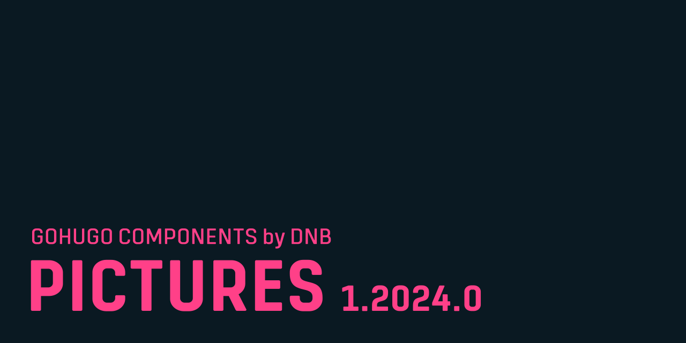

This component for [GoHugo](https://gohugo.io/) adds partials and shortcodes to handle images on your website. It offers responsive image formats and optimized loading based on current browser abilities.

## Documentation 

Read more about it [in the documentation](documentation/index.md). 

> [!WARNING]
> The documentation is provided as is and was at the point of writing work in progress. Things might have changed.

