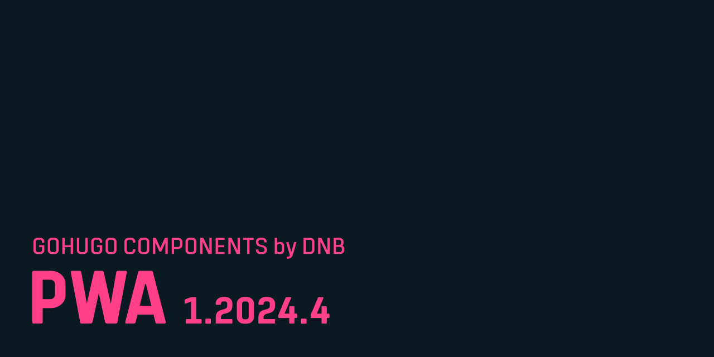

This is a Hugo theme component with helpers to convert your static [GoHugo](https://gohugo.io/) website into a [PWA](https://web.dev/progressive-web-apps/).

This is work in progress and while many parts are already working, some changes to the setup will occur. Please watch the releases of this repository to be alerted about changes.

## Documentation 

Read more about it [in the documentation](documentation/index.md). 

> [!WARNING]
> The documentation is provided as is and was at the point of writing work in progress. Things might have changed.
