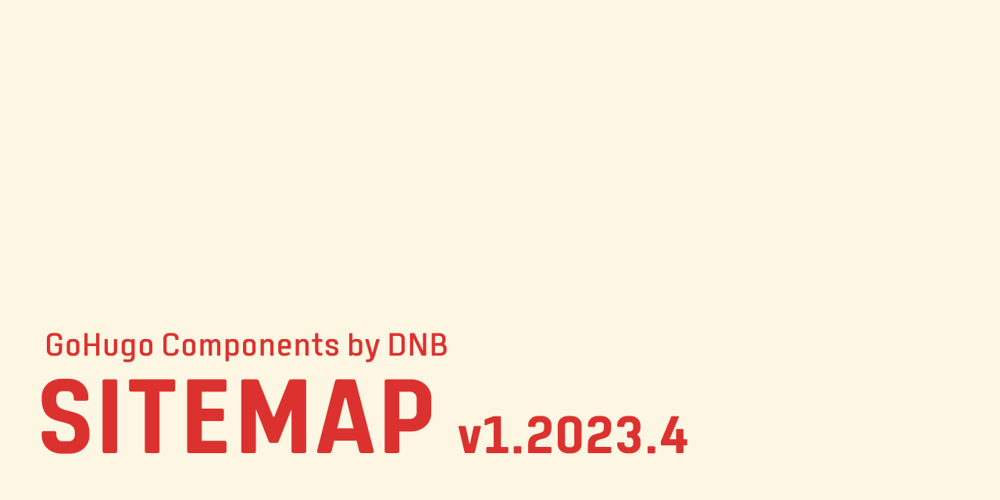

# GoHugo Component / Sitemap

This is a Hugo theme component with layouts to add a configurable sitemap to your website. Hugo itself has internal templates that add sitemaps, but this component has additional setup options per page.

Read more about it [in the documentation](https://kollitsch.dev/gohugo/sitemap/).
