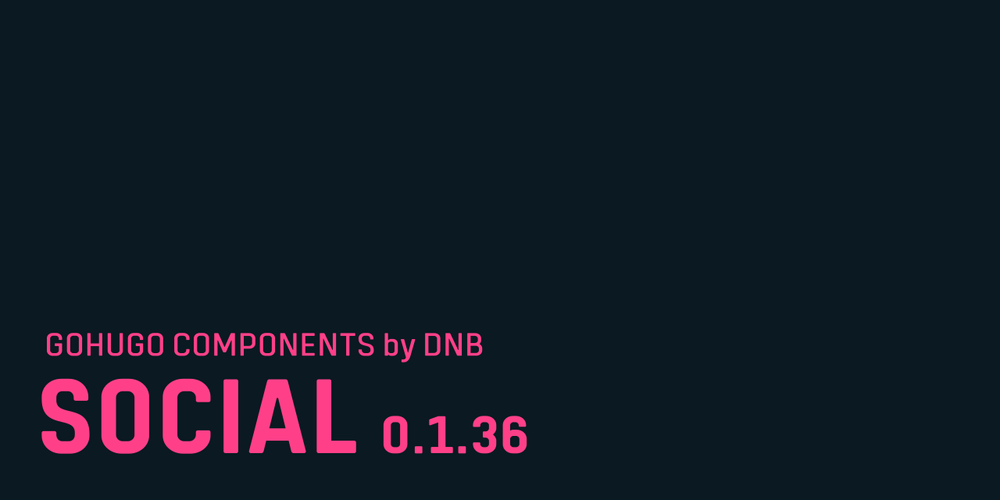

# David's Neighbour GoHugo Component / Social

Social Media functionality for Hugo

<!--- THINGSTOKNOW BEGIN --->

## Some things you need to know

These are notes about conventions in this README.md. You might want to make yourself acquainted with them if this is your first visit.

<details>

<summary>:heavy_exclamation_mark: A note about proper configuration formatting. Click to expand!</summary>

The following documentation will refer to all configuration parameters in TOML format and with the assumption of a configuration file for your project at `/config.toml`. There are various formats of configurations (TOML/YAML/JSON) and multiple locations your configuration can reside (config file or config directory). Note that in the case of a config directory the section headers of all samples need to have the respective section title removed. So `[params.dnb.something]` will become `[dnb.something]` if the configuration is done in the file `/config/$CONFIGNAME/params.toml`.

</details>
<!--- THINGSTOKNOW END --->

<!--- INSTALLUPDATE BEGIN --->

## Installing

First enable modules in your own repository if you did not already have done so:

```bash
hugo mod init github.com/username/reponame
```

Then add this module to your required modules in `config.toml`.

```toml
[module]

[[module.imports]]
path = "github.com/davidsneighbour/hugo-social"
disable = false
ignoreConfig = false
ignoreImports = false

```

The next time you run `hugo` it will download the latest version of the module.

## Updating

```bash
# update this module
hugo mod get -u github.com/davidsneighbour/hugo-social
# update to a specific version
hugo mod get -u github.com/davidsneighbour/hugo-social@v1.0.0
# update all modules recursively over the whole project
hugo mod get -u ./...
```
<!--- INSTALLUPDATE END --->

## Usage

... to be written ...

<!--- COMPONENTS BEGIN --->

## Other [GoHugo](https://gohugo.io/) components by [@davidsneighbour](https://github.com/davidsneighbour/)

<!-- prettier-ignore -->
| Component | Description |
| :--- | :--- |
| [hugo-auditor](https://github.com/davidsneighbour/hugo-auditor) | |
| [hugo-debug](https://github.com/davidsneighbour/hugo-debug) :mage_man: | Debug EVERYTHING in GoHugo. |
| [hugo-errors](https://github.com/davidsneighbour/hugo-errors) | A Hugo module that adds more versatile error pages to a site. |
| [hugo-feeds](https://github.com/davidsneighbour/hugo-feeds) | Implements various configurable feed formats. |
| [hugo-functions](https://github.com/davidsneighbour/hugo-functions) | A Hugo theme component with helper functions for other projects. |
| [hugo-giscus](https://github.com/davidsneighbour/hugo-giscus) | The Giscus comment system layout for GoHugo. |
| [hugo-head](https://github.com/davidsneighbour/hugo-head) | A GoHugo theme component that solves the old question of "What tags belong into the `<head>` tag of my website?" |
| [hugo-hooks](https://github.com/davidsneighbour/hugo-hooks) | Hooks for GoHugo layouts. An easy way for theme developers to let users add to their themes.  |
| [hugo-humans](https://github.com/davidsneighbour/hugo-humans) | Your site is made by humans. Humans.txt is naming them. |
| [hugo-icons](https://github.com/davidsneighbour/hugo-icons) | Icons for your Hugo website. |
| [hugo-internals](https://github.com/davidsneighbour/hugo-internals) | Better internal templates for GoHugo |
| [hugo-netlification](https://github.com/davidsneighbour/hugo-netlification) | a collection of tools that optimize your site on Netlify |
| [hugo-opensearch](https://github.com/davidsneighbour/hugo-opensearch) | configuration for Open Search |
| [hugo-pictures](https://github.com/davidsneighbour/hugo-pictures) | |
| [hugo-pwa](https://github.com/davidsneighbour/hugo-pwa) | Automatically turns your site into a PWA |
| [hugo-renderhooks](https://github.com/davidsneighbour/hugo-renderhooks) | render hooks for Markdown markup |
| [hugo-robots](https://github.com/davidsneighbour/hugo-robots) | Add a customizable robots.txt to your website. |
| [hugo-schema](https://github.com/davidsneighbour/hugo-schema) | |
| [hugo-search-algolia](https://github.com/davidsneighbour/hugo-search-algolia) | |
| [hugo-security](https://github.com/davidsneighbour/hugo-security) | Add a security.txt to your site with information about your preferred procedures to notify the developer team about security issues. |
| [hugo-sitemap](https://github.com/davidsneighbour/hugo-sitemap) | |
| [hugo-social](https://github.com/davidsneighbour/hugo-social) | |
| [hugo-workflows](https://github.com/davidsneighbour/hugo-workflows) | A collection of Github Actions/Workflows to optimise your work with GoHugo. |
| [hugo-youtube](https://github.com/davidsneighbour/hugo-youtube) | A shortcode and partial for lite and speedy youtube embeds. |

<!--lint disable no-missing-blank-lines -->
<!--- COMPONENTS END --->

## Contributors ✨

Thanks goes to these wonderful people ([emoji key](https://allcontributors.org/docs/en/emoji-key)):

<!-- ALL-CONTRIBUTORS-LIST:START - Do not remove or modify this section -->
<!-- prettier-ignore-start -->
<!-- markdownlint-disable -->
<table>
  <tr>
    <td align="center"><a href="https://kollitsch.de"><br /><sub><b>Patrick Kollitsch</b></sub></a><br /><a href="https://github.com/davidsneighbour/hugo-social/commits?author=davidsneighbour" title="Code">💻</a> <a href="https://github.com/davidsneighbour/hugo-social/commits?author=davidsneighbour" title="Documentation">📖</a> <a href="#ideas-davidsneighbour" title="Ideas, Planning, & Feedback">🤔</a> <a href="#maintenance-davidsneighbour" title="Maintenance">🚧</a> <a href="https://github.com/davidsneighbour/hugo-social/commits?author=davidsneighbour" title="Tests">⚠️</a></td>
    <td align="center"><a href="https://github.com/jmooring"><br /><sub><b>Joe Mooring</b></sub></a><br /><a href="https://github.com/davidsneighbour/hugo-social/commits?author=jmooring" title="Code">💻</a></td>
  </tr>
</table>

<!-- markdownlint-restore -->
<!-- prettier-ignore-end -->

<!-- ALL-CONTRIBUTORS-LIST:END -->

This project follows the [all-contributors](https://github.com/all-contributors/all-contributors) specification. Contributions of any kind welcome!
